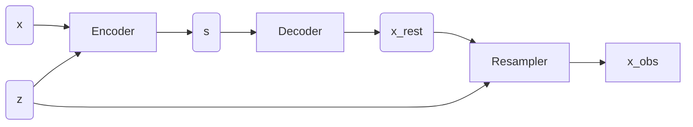

# Diezi 🥘
Diezi (碟子): Fill a small dish with HSC low surface brightness galaxies

This repo is for the notebook and scripts used for modeling LSBGs in HSC using scarlet.

`diezi/setup_env.sh` can be used on `Tiger` and `Tigressdata` to setup the proper environment for the task. Under LSST Pipeline, only Python 3.7.8 is available. Please run `diezi/setup_env.sh` before running any code in `diezi`.

**Working directories:**
- Data: `/tiger/scratch/gpfs/jiaxuanl/Data/HSC/LSBG/`
- Code/Notebooks: `/home/jiaxuanl/Research/Packages/kuaizi/diezi`

Completeness: `diezi/scarlet_modeling/mock_sample/detection_completeness.ipynb` and `diezi/scarlet_modeling/mock_sample/deblend_completeness.ipynb`

### Data Structure

Cutouts (and corresponding PSFs) with size of 0.6 arcmin in 5 bands takes 11 Mb. 

After pickling, one galaxy in 5 bands takes 7.1 Mb. 

Thumb of rule: test the script/notebook on `tiger`, run the whole sample on `/scratch/gpfs/jiaxuanl/Data/HSC/LSBG`, only copy the figures to `/tigress/jiaxuanl/public_html` for displaying. 

Once we have a final sample, we will move catalogs, modeling outputs to `tigressdata` for storage.

### Sample selection
The sample selection is largely done on my own MacBook: https://github.com/AstroJacobLi/HSC_LSBG/tree/master/sample

#### Milky-Way like hosts
See https://github.com/AstroJacobLi/HSC_LSBG/blob/master/sample/MW-like/README.md.

### Work flow

1. Raw catalogs (from Johnny Greco) are saved at `/tiger/scratch/gpfs/jiaxuanl/Data/HSC/LSBG/Catalog`. Please check `diezi/gen_cutout/candy_sample_cutout.ipynb` for modifying the Candy sample catalog. I add `cutout_size` as well as the cutout directory in the new catalog, saved as `/tiger/scratch/gpfs/jiaxuanl/Data/HSC/LSBG/Cutout/Candy/candy_cutout_cat.fits`. 

2. Please use `diezi/gen_cutout/lsbg_cutout_s18a.sh` to generate cutouts. Files should be saved at `/tiger/scratch/gpfs/jiaxuanl/Data/HSC/LSBG/Cutout`. For very few galaxies, HSC pipeline fails to generate PSFs at their locations. In this case, we use the default PSF (randomly choosen from a location), they are named as `psf_x.fits` in the `Cutout` folder. 

### UDG sample selection
1. Run vanilla scarlet and spergel scarlet on all LSBGs matched with MW analogs at 0.01 < z < 0.04.

2. Apply cuts based on vanilla measurements. See `scarlet_modeling/nsa_z002_004/NSA-structure-vanilla-cuts-all.ipynb`. The output catalog is `/Catalog/nsa_z001_004/lsbg_after_cuts_spergel_w_missed.fits`.

3. All notebooks related to UDG science plots are in `scarlet_modeling/nsa_z002_004/UDG`. In the notebook `UDG_sample_selection.ipynb`, we select UDGs from the cuts-applied catalog. At the same time, the random field experiment is done in `scarlet_modeling/random_field/random-field-structure-vanilla-cuts-UDG.ipynb`. Notice that random field exp need an UDG catalog. 

4. Make science plots.

### Image Gallery

Cutout images of the candy sample: http://tigress-web.princeton.edu/~jiaxuanl/candy/cutout_figure/page1.html

### Structural measurement
pip install statmorph --user